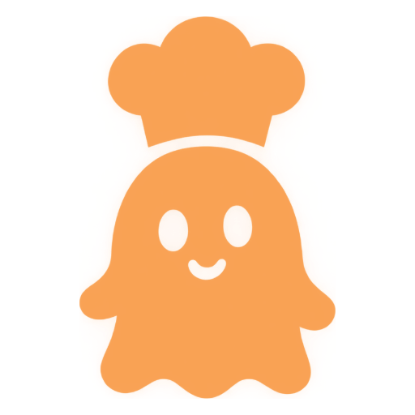
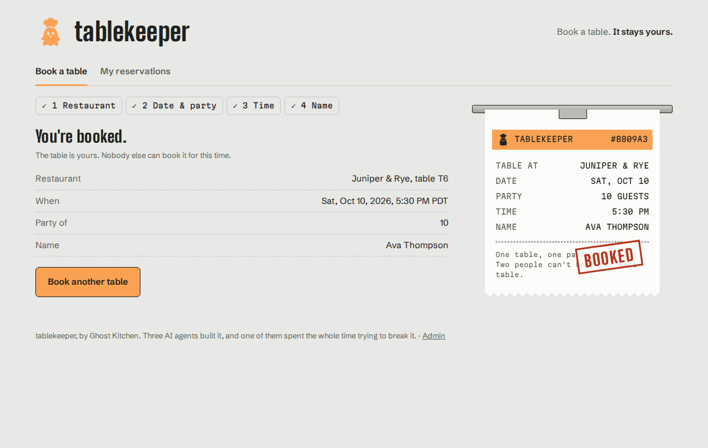
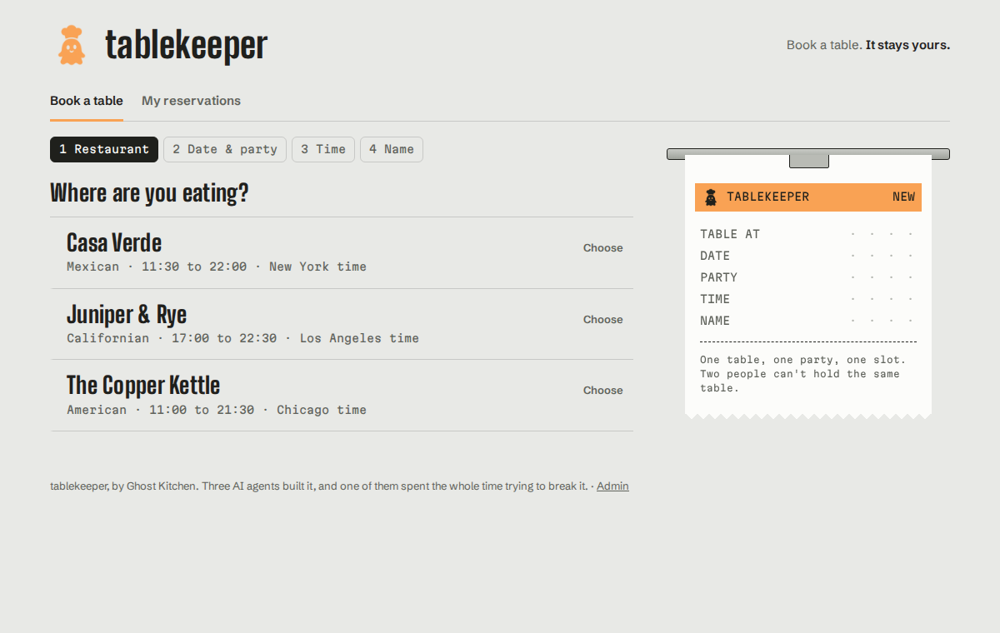
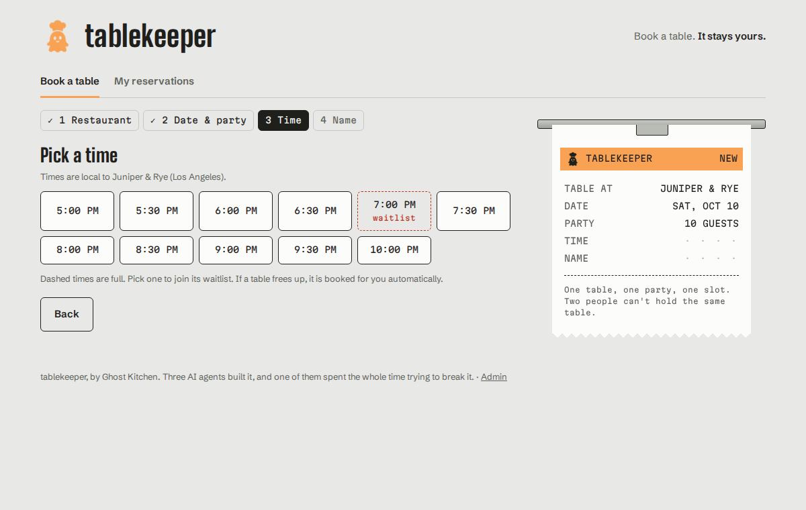
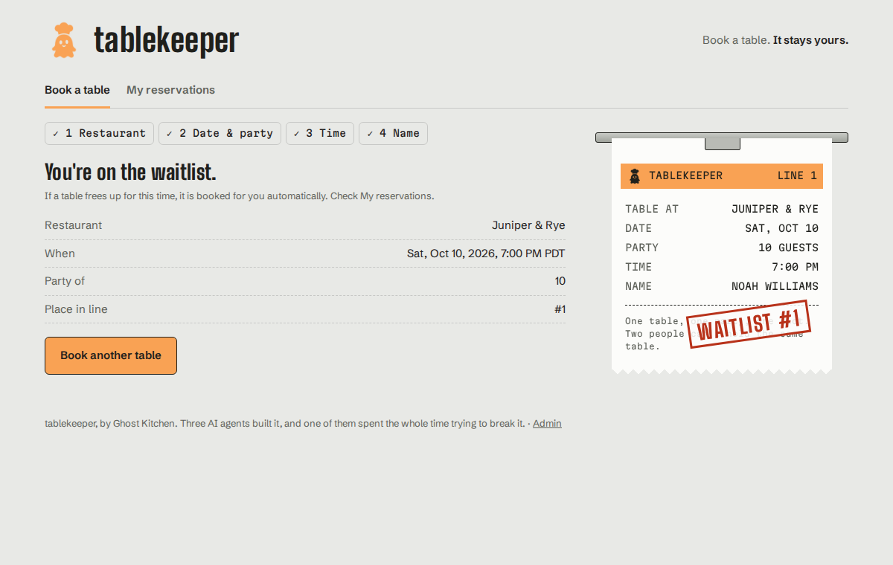
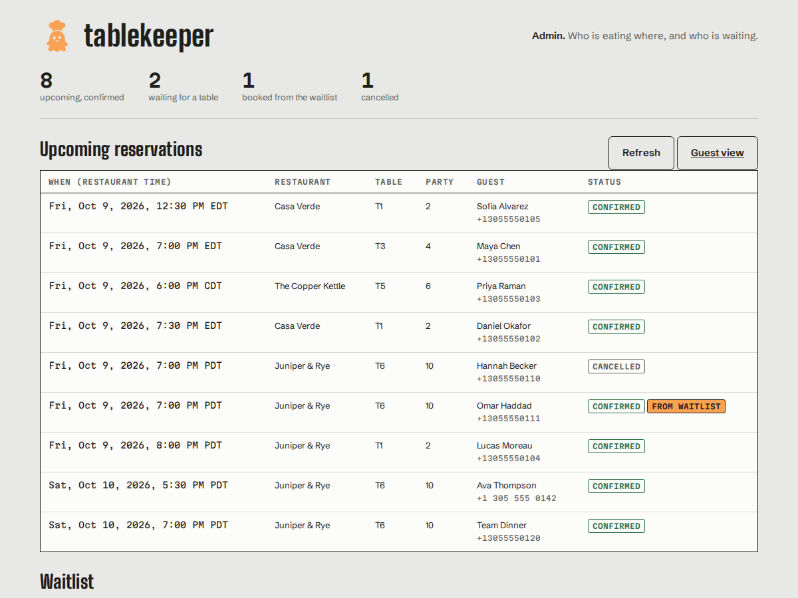
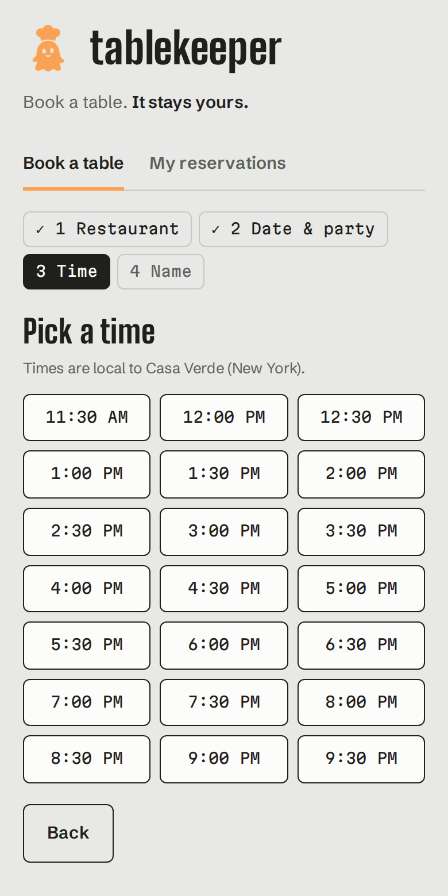

# Ghost Kitchen · tablekeeper

**A restaurant booking site built by a team of three AI coding agents: one plans, one builds, one checks.**
Its one hard rule: a table can never be given to two parties at the same time.

<p align="center">
  <br>
  <sub>Every booking builds a kitchen order ticket as you go. Confirm it and it gets stamped.</sub>
</p>

Built for the WeAreDevelopers × BAND **AI Dark Factory** hackathon (tablekeeper track) by team Ghost Kitchen.

---

## What it does

- **Browse** three restaurants in three US time zones.
- **Check availability** for a date and party size. Times show in the restaurant's local time.
- **Book** a table in four steps, on desktop or phone.
- **Join a waitlist** when a time is full. If someone cancels, the next guest in line is booked onto that table automatically.
- **View or cancel** your bookings with the phone number you booked with.
- **Admin dashboard** shows upcoming reservations, the waitlist, and who got a table from the waitlist.

<table>
  <tr>
    <td width="50%"><br><sub><b>1.</b> Choose a restaurant</sub></td>
    <td width="50%"><br><sub><b>2.</b> Pick a time. Dashed times are full and offer the waitlist</sub></td>
  </tr>
  <tr>
    <td width="50%"><br><sub><b>3.</b> A full time? Join the waitlist and see your place in line</sub></td>
    <td width="50%"><br><sub><b>4.</b> Admin: a cancelled booking and the guest moved up from the waitlist</sub></td>
  </tr>
</table>

<p align="center">
  <br>
  <sub>Works on a phone, too.</sub>
</p>

---

## How it was built: the factory

The real entry is the **team of AI agents** that built the app. Each agent has one job and isn't allowed to do the others':

| Agent | Job | Not allowed to |
|---|---|---|
| **Planner** | Splits the assignment into small tasks and writes down how anyone could tell each one is finished | Write code |
| **Builder** | Writes the code and hands each task over with the commands to verify it | Mark its own work as done |
| **Checker** | Tests the work, tries to break it, and reports exactly what failed | Fix anything itself |

Why split it up? An agent that writes the work and also grades it gives itself an A. The Checker exists so **"done" means someone else actually saw it work.**

The agents' job descriptions ([`seats/`](seats/)) never mention restaurants, so the same team can be pointed at a different project. A person hands the team its assignment and steers between steps; the agents do the planning, building, and checking. Every plan, handoff, and verdict is recorded in [`room/transcript.md`](room/transcript.md).

**The Checker caught real problems.** In the first run it approved work it shouldn't have, so we rewrote its instructions: it now has to prove every safety test can fail. In the second run, an independent Checker rejected the work three times and found 7 problems, all fixed before its final approval. [`FACTORY.md`](FACTORY.md) tells the whole story, including what went wrong.

---

## Why a table never gets booked twice

Think of two people buying the last concert ticket in the same second. tablekeeper makes sure only one of them gets it:

1. **One booking at a time.** Each booking briefly locks the database, so two can't slip in at once, even across several server processes.
2. **The database refuses duplicates.** Even if something got past the lock, the database won't store two bookings for the same table at the same time.
3. **No double clicks.** If a booking request gets sent twice by accident, the repeat is recognized and nothing is booked twice.
4. **Only real time slots.** Bookings start at 7:00 or 7:30, never 7:15, so two bookings can't quietly overlap.

**Proof:** a test fires 50 bookings for the same table at the same moment, across 4 server processes. **Exactly 1 succeeds and 49 are told it's taken.**

**Testing the test:** a test that can't fail proves nothing. So the suite also deletes the protections and runs the race again:

| Protections in place | Bookings that got the table |
|---|---|
| All | 1 ✅ |
| Lock removed | 1 ✅ (the database rule still holds) |
| Database rule removed | 1 ✅ (the lock still holds) |
| **Both removed** | **4 ❌ (the test catches it)** |

---

## Run it

You need [Node.js](https://nodejs.org) 22.5 or newer. Nothing else: the database (SQLite) and time-zone handling are built into Node.

```sh
cd stage-2
npm ci        # install the one dependency (express)
npm start     # open http://localhost:3000   ·   admin: http://localhost:3000/admin
```

Run the checks (about 8 seconds):

```sh
npm test      # 64 checks + the "testing the test" race above
```

Or with Docker. The service also starts and runs with networking turned off entirely; see [`stage-2/README.md`](stage-2/README.md) for that check.

```sh
cd stage-2
docker build -t tablekeeper .
docker run --rm -p 3000:3000 tablekeeper
```

---

## What's in this repo

| Path | What it is |
|---|---|
| [`stage-1/`](stage-1/) | The core app: browse, check availability, book, view and cancel |
| [`stage-2/`](stage-2/) | Stage 1 plus the waitlist and the admin dashboard (**run this one**) |
| [`seats/`](seats/) | The three agents' job descriptions |
| [`room/`](room/) | The assignment the agents were given and the full transcript of their work |
| [`FACTORY.md`](FACTORY.md) | How the factory works, design choices, and an honest account of both runs |
| [`docs/deck/`](docs/deck/) | The slide deck ([PDF](docs/deck/ghost-kitchen-deck.pdf)) and its HTML source |
| [`DESIGN.md`](DESIGN.md) | Design decisions: palette, type, the order-ticket idea, what we avoided |
| [`video-script.md`](video-script.md) | Walkthrough for the demo video |

Technical details (API, guarantees, limits) are in [`stage-1/README.md`](stage-1/README.md) and [`stage-2/README.md`](stage-2/README.md).
